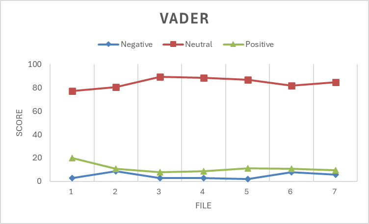
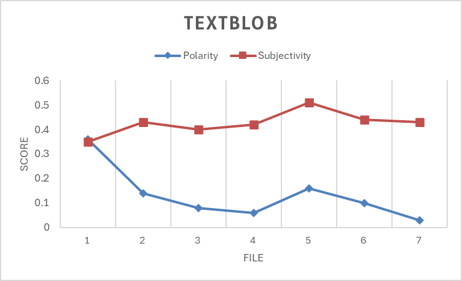
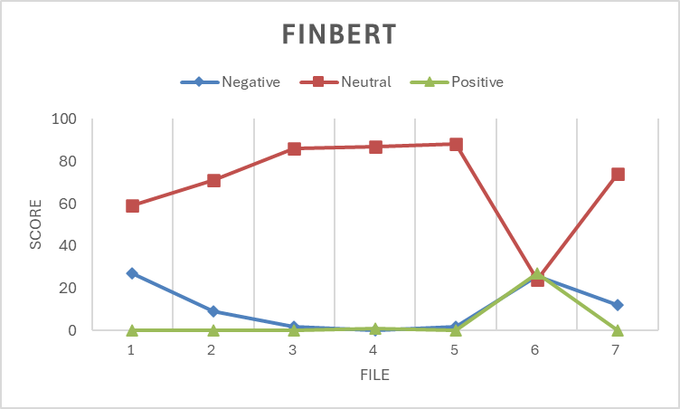

# Junior Seminar (CMPSC 580) Project Proposal

## Semester: Spring 2024

## GitHub Handle: hayleepierce

## Name: Haylee Pierce

## Major: Computer Science

## Project Title: Corpus Comb

---

## Introduction

```
TODO: Introduce the proposed project, providing a concise summary of the project goals, its key elements, offering the reader a quick understanding of the research's scope. The section continues to outline the main topics, research questions, hypotheses, and /or theories in a clear and meaningful language to provide a type of roadmap for the reader to navigate the forthcoming details of the project. This section also needs to motivate the project by providing context for the study, outlining the current state of knowledge in the field, and highlighting any gaps or limitations in existing research. The section serves as a foundational guide that enables the reader to grasp the context of the study, in addition to its structure, before moving into a more technically-based discussion in the following sections of the article. In short, the "Introduction" section needs to answer the `what` and `why` questions, that is `what is the project?` and `why is the project important?`
```

The goal of this proposed project is to provide users with a way to detect bias within their sources. The project will use sentiment analysis to detect bias, with the theory that the more neutral the score the more unbiased the source is. The project will use the HTML representation of the users' sources, obtaining the HTML code through the process of web scraping. The HTML will be parsed using the Beautiful Soup library from Python. Sentiment analysis will then be performed, providing the user with the results. The project will take the form of a web application, built using Flask.

This project will expand the literature on sentiment analysis, as the current literature primarily covers sentiment analysis in the context of social media, finacies, and public opinion. This project will also make the process of finding quality sources easier. Finding quality sources and detecting bias within sources is not only time consuming, but also effected by the researcher's bias. This project will reduce the time it takes to find quality sources and reduce effect of the user's bias.

## Literature Review

```
TODO (10 source minimum, with 5 of those being published peer-reviewed articles): Conduct literature review by describing relevant work related to the project and hence providing an overview of the state of the art in the area of the project. This section serves to contextualize the study within the existing body of literature, presenting a thorough review of relevant prior research and scholarly contributions. In clear and meaningful language, this section aims to demonstrate the problems, gaps, controversies, or unanswered questions that are associated with the current understanding of the topic. In addition, this section serves to highlight the current study's unique contribution to the field. By summarizing and critiquing existing works, this section provides a foundation for readers to appreciate the novelty and significance of the study in relation to the broader academic discourse. The "Literature Review" section further (in detail) contributes to the `why is the project important?` question.
```

### Sentiment Analysis

Sentiment analysis is the process of identifying the emotion/tone behind a piece of text. There are numerous models that are pre-trained to perform sentiment analysis, including VADER (Valence Aware Dictionary and sEntiment Reasoner), TextBlob, and BERT (Bidirectional Encoder Representations from Transformers). 

The majority of existing literature uses VADER and/or TextBlob to analyze text from social media posts [1, 2, 3]. The VADER model provides a positive, negative, and neutral score that add to a total of 100. A downside to this model is that it was trained using data from social media; consequently, analysis of any other type of text is not guaranteed to be accurate. The TextBlob model produces a polarity score between -1 and 1 and a subjectivity score between 0 and 1. Unfortunately, the documentation about what data was used to train the model is lacking.

Some of the literature uses BERT to perform sentiment analysis; for example, Singh et. al. [2021] classifies the emotion of tweets relating to COVID-19 using the BERT model [4]. Alaparthi and Mishra [2021] look at four different methods of performing sentiment analysis, two of them being the BERT and SentiWordNet models [5].

### Data: Gathering and Preparation

Web scraping is the process of extracting data from websites. Vincent Smith [2019] discusses web scraping in-depth and walks the reader through the process of developing a web scraping tool using the programming language Go [6].

The Beautiful Soup Python library allows for the parsing of HTML files [7]. This library can be used to find specific information from the HTML files obtained by scraping the web, such as the URL and the title. It can also be used to prepare a string of text for analysis. Yongquan Li [2022] used several Python libraries, including the Beautiful Soup library to discuss methods of data collecting and HTML parsing [8].

Text mining is the process of deducing meaningful information from the patterns and trends found within text. One book written on this process covers several algorithms that are used to mine text, discussing the theory behind them and how to apply them [9]. Another book on text mining focuses on the process of mining through text that is unstructured and how the process is different than mining through structured text [10].

### User Interface

Flask is a web framework that was written using Python. It can be used in conjunction with other libraries to build a web application and provide users with a friendly interface to interact with. Matt Copperwaite and Charles Leifer [2015] wrote a book that provides helpful explanations of Flask [10].

## Prototype

```
TODO: Discuss the methods of the project to be able to answer the `how` question (`how was this project completed?`). For this section, you must describe  the methodology behind your implemented prototype. The methods section in an academic research outlines the specific procedures, techniques, and methodologies employed to conduct the study, offering a transparent and replicable framework for the research. It details the resources behind the work, in terms of, for example, the design of the algorithm and the experiment(s), data collection methods, applied software libraries, required tools, the types of statistical analyses and models which are applied to ensure the rigor and validity of the study. This section provides clarity for other researchers to understand and potentially replicate the study, contributing to the overall reliability and credibility of the research findings.
```

The data used for this prototype is in the form of HTML files. The collection of this data was done manually by right-clicking on a web page and saving the page's HTML code. These files are saved within the `data/corpus` folder.

The processing of this data is done using the Beautiful Soup Python library [7]. A function called `develop_corpus_html()` was created that iterates through all the files within the `data/corpus` folder. The Beautiful Soup's `get_text()` function is used to extract the title and content from the files. This information is added to a dictionary and the dictionary is then added to a list. The function returns the list, which contains a dictionary for each of the files within the `data/corpus` folder.

Sentiment analysis is then performed of the content of each of the files. Three pre-trained sentiment analysis models are used: VADER, TextBlob, and finBERT. To use VADER, the `vader_lexicon` from NTLK must first be downloaded. Next, the `polarity_scores()` function is called using the content as the input. This function returns a positive, negative, and neutral score. TexBlob does not have any requirements, so to use this model all that needs to be run is `TextBlob()` with the content as the input. TextBlob produces a polarity and subjectivity score, which are accessed using `.sentiment.polarity` and `.sentiment.subjectivity` respectively. To use finBERT, the model first needs to be found by running the following function: `HappyTextClassification("BERT", "ProsusAI/finbert", num_labels=3)`. This model has a limit on the length of input; therefore, the content was split into strings of 1,000 characters. The average of all the results was then found to determine the positive, negative, and neutral score of the content, as a whole. All of these scores are displayed to the user along with the title of their corresponding file.

## Preliminary Results and Outcomes

```
TODO: Discuss the outcomes of your project in this section. Depending on the project type, the presented results and outcomes will vary. In some projects, you will be asked to present a theoretical analysis, and in others your experimental study and its results. In this section, you are also to demonstrate an enhanced version of your artifact by showing its capabilities and applications, in light of the evaluation metrics for assessing the artifact
```

The prototype of this project acted as an analysis of three different pre-trained sentiment analysis models are used: VADER, TextBlob, and finBERT. Using the results of the sentiment analysis, I reached the conclusion that none of the models are the best to use for this project, as they did not provide what I would consider to be accurate results.

VADER is pre-trained using social media posts, meaning the results are most accurate when analyzing social media content. The result of this model were extremely similar across the board. As the data used for the analysis was vastly different, the result indicate that the model is unable to detect these differences.


*Fig. 1. Results of VADER sentiment analysis.*

TextBlob provided the best results of the three, but the documentation about what data was used to train the model is limited; therefore, it is not the most reliable. The results of this model are also in a different form than the other two, as it provides a polarity and subjectivity score instead of positive, netral, and negative scores. This difference makes it difficult to compare the results.


*Fig. 2. Results of TextBlob sentiment analysis.*

The last model finBERT is a model of BERT that is pre-trained using finacial data. Similar to VADER, the results are most accurate when analyzing the data it was trained one (finacial data). The length limit on the input also makes the result less reliable, as the average of the results would be less acurate than a result from an analysis of the whole string.


*Fig. 3. Results of finBERT sentiment analysis.*

## Conclusions and Future Work

```
TODO: Summarize your work and outline future steps needed to complete to take the project to the next stage (for example, if you were to continue with this project in 600/610). You must also address ethical implications of your project, especially as pertains to the public release or use of your software or methods.
```

Due the the results stated above, my next steps include investigating other sentiment analysis models. I plan to look for other pre-trained BERT models that are not trained on any specific type of data. I also plan to look at SentiWordNet, as the study done by Alaparthi and Mishra [2021] yeilded promising results [5]. If I find that these (and any other models I happen to find) do not produce adequate results, I will most likely use TextBlob, as it was the best of the three tested by this prototype.

After I decide on a model for sentiment analysis, I then need to implement my process of data gathering and processing. This process will use methods of web scrapign and text mining, as well as utilize the Beautiful Soup Python library.

Finally, a user interface will need to be developed, which will be done using Flask. The interface will allow the user to add new sources, remove old ones, and view the scores of all the added sources.

## References

[1] Sai Dheeraj Kanaparthi, Anjali Patle, and K. Jairam Naik. 2023. Prediction and detection of emotional tone in online social media mental disorder groups using regression and recurrent neural networks. _Multimedia Tools and Applications_ 82 (April 2023) 43819–43839. <https://doi.org/10.1007/s11042-023-15316-x>

[2] Ilias Chalkias, Katerina Tzafilkou, Dimitrios Karapiperis, and Christos Tjortjis. 2023. Learning Analytics on YouTube Educational Videos: Exploring Sentiment Analysis Methods and Topic Clustering. _Electronics_ 12, 18 (Sep. 2023) 1-13. <https://doi.org/10.3390/electronics12183949>

[3] Wajdi Aljedaani, Furqan Rustam, Mohamed Wiem Mkaouer, Abdullatif Ghallab, Vaibhav Rupapara, Patrick Bernard Washington, Ernesto Lee, and Imran Ashraf. 2022. Sentiment analysis on Twitter data integrating TextBlob and deep learning models: The case of US airline industry. _Knowledge-Based _Systems_ 255 (Nov. 2022) 1-15. <https://doi.org/10.1016/j.knosys.2022.109780>

[4] Mrityunjay Singh, Amit Kumar Jakhar, and Shivam Pandey. 2021. Sentiment analysis on the impact of coronavirus in social life using
the BERT model. _Social Network Analysis and Mining_ 11, 1 (March 2021) 1-11. <https://doi.org/10.1007/s13278-021-00737-z>

[5] Shivaji Alaparthi and Manit Mishra. 2021. BERT: a sentiment analysis odyssey. _Journal of Marketing Analytics_ 9 (Feb. 2021) 118–126. <https://doi.org/10.1057/s41270-021-00109-8>

[6] Vincent Smith. 2019. _Go Web Scraping Quick Start Guide: Implement the Power of Go to Scrape and Crawl Data from the Web_. Packt Publishing, Birmingham, UK.

[7] Leonard Richardson. 2019. Beautiful Soup Documentation. (Dec. 2019) Retrieved from <https://beautiful-soup-4.readthedocs.io/en/latest/>

[8] Yongquan Li. 2022. Python Data Analysis and Attribute Information Extraction Method Based on Intelligent Decision System. _Mobile Information Systems_ 2022, (April 2022), 1–10. <https://doi.org/10.1155/2022/2495166>

[9] Michael W. Berry and Jacob Kogan (Eds.). 2010. _Text Mining: Applications and Theory_. John Wiley & Sons, Chichester, UK.

[10] Sholom M. Weiss, Tong Zhang, Nitin Indurkhya, and Fred J. Damerau. 2010. _Text Mining: Predictive Methods for Analyzing Unstructured Information_. Springer Science & Business Media, New York, NY.

[11] Matt Copperwaite and Charles Leifer. 2015. _Learning Flask Framework: Build Dynamic, Data-driven Websites and Modern Web Applications with Flask_. Packt Publishing, Birmingham, UK.

```
TODO: Add references in the [ACM style](https://www.acm.org/publications/authors/reference-formatting). All references must be cited in the proposal.
```
